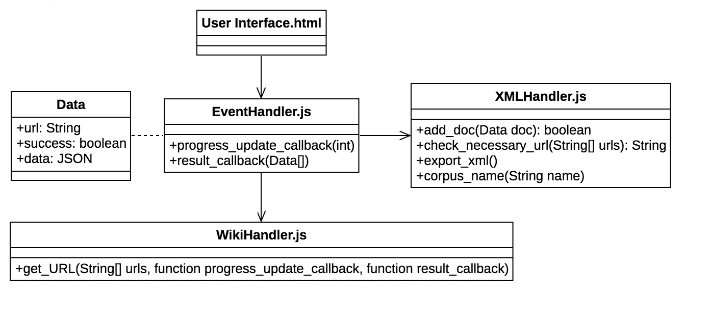
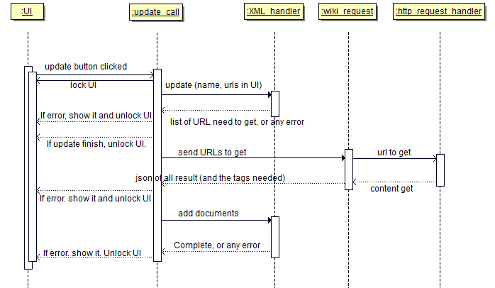

# WIKI to docuXML

This project is aimed to create [docuXML][1] from a wiki page.
Given wiki page URLs, we can generate a [docuXML][1] file using this project.

All the testing and developement are based on Chinese wiki pages (zh.wikipedia.org) for now.

[1]: https://docusky.org.tw/DocuSky/documentation/docs/DocuXml-1.2-Scheme.html

## Usage

WIP.

## Structure

* Structure



## Sequence Diagram

* Open


* Update



## Contribution

Please fork the porject, and submit pull request to me.

1. Fork the project.

2. Clone your project and execute the following command (replace the text inside '[]' below with this repository).
```
git remote add upstream [this git repository, https or ssh]
```

3. To sync with upstream master, execute the following command (replace the text inside '[]').
```
git pull --rebase upstream master
```
Remember to set '--rebase' tag.

4. Before issuing new pull requests, sync with upstream master first!!

5. You can/should do whatever you want to make your branch clean and organized before issuing new pull requests.
